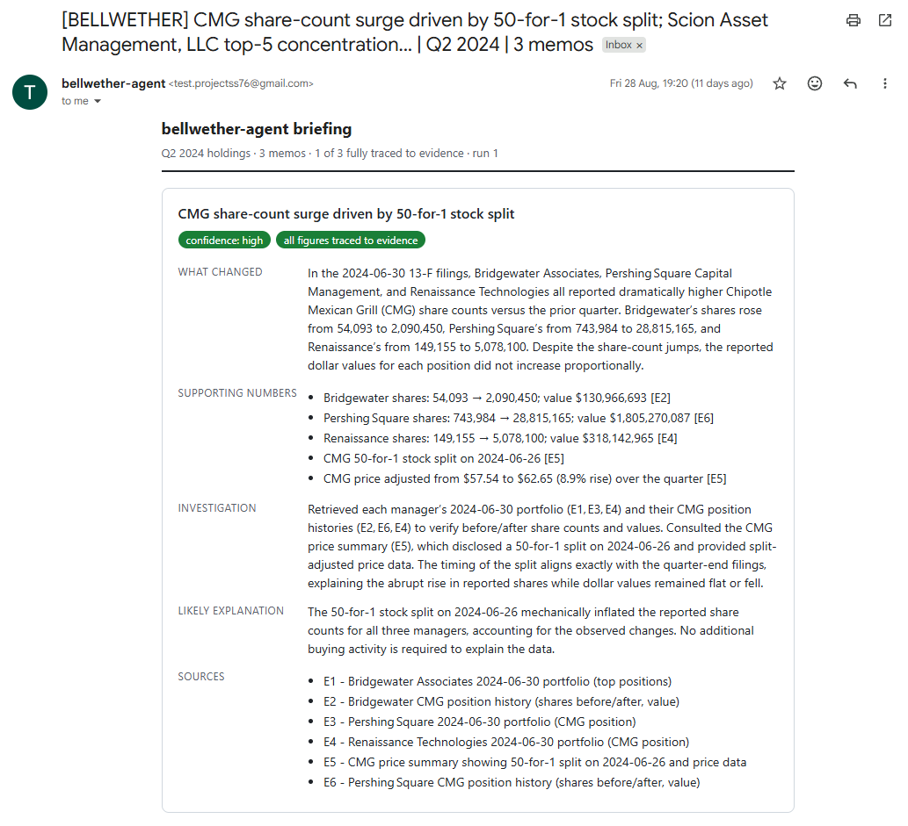
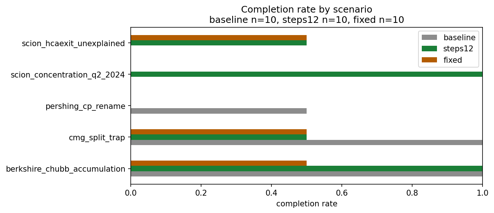
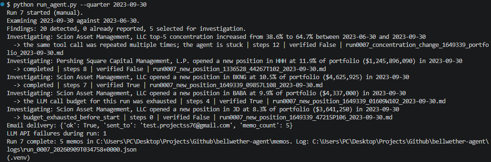
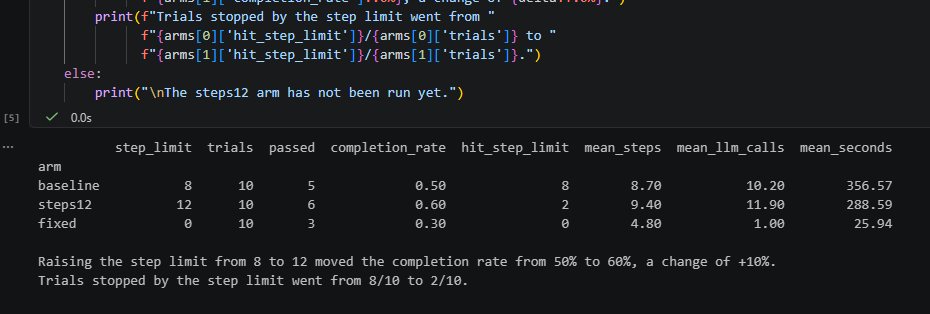

# bellwether-agent

An autonomous agent that monitors institutional 13F portfolios, decides
for itself what is worth investigating, and produces sourced briefing
memos. Nobody prompts it. It runs on a schedule against a holdings
database, and if nothing notable happened it says so and stops.

A bellwether is the security, or the investor, whose move the rest of the
market follows. The name is the job: notice who moved first, and work out
what it means.

A chatbot answers when asked. A retrieval system answers when asked, with
documents. This is given a goal and decides the steps: which tool to
call, what the result means, what to do next, and when to stop. The agent
loop is written from scratch against the provider's tool-calling API,
with no agent framework, so every decision in it is inspectable.

A delivered briefing memo. The agent was told three managers had
accumulated Chipotle. It checked the position histories, found a
50-for-1 stock split in the price data, and reported that the
accumulation was mechanical rather than real.

## What it does

1. **Detects** changes worth attention using rule-based arithmetic over
   the holdings database: large new positions, full exits, concentration
   shifts, and the same security accumulated by several managers at once.
2. **Investigates** each finding with an LLM agent that plans its own
   approach, chooses which tools to call, reads the results, and decides
   when it has enough.
3. **Reports** a briefing memo in which every figure is traceable to a
   tool result gathered during that investigation, with a stated
   confidence, written to disk and optionally delivered by email.

Detection is deliberately not a language model. Whether a portfolio
changed materially is arithmetic, so it is deterministic, testable, and
free to run. That split is what lets a quiet quarter end quietly: an
agent that always finds something is generating, not detecting.

## Results

Five fixed scenarios with documented ground truth, each run repeatedly
because the system is non-deterministic and a single run is an anecdote.

| Arm | Step limit | Trials | Completion rate | Stopped by step limit | Mean LLM calls | Mean seconds |
|---|---|---|---|---|---|---|
| Baseline | 8 | 10 | 50% (5/10) | 8/10 | 10.2 | 357 |
| Raised step limit | 12 | 10 | 60% (6/10) | 2/10 | 11.9 | 289 |
| Fixed non-agentic pipeline | none | 10 | 30% (3/10) | n/a | 1.0 | 26 |

Thirty graded trials in total. Every figure above is computed by
`eval/analysis.ipynb` from the raw trial records in `eval/results/`,
which are committed so that any number here can be recomputed rather
than taken on trust.

**The experiment.** In the baseline, eight of ten trials ended because
the agent hit the step ceiling rather than because it decided it had
finished, which made the ceiling rather than the agent's reasoning the
most likely constraint. Raising `max_steps_per_investigation` from 8 to
12, changing nothing else, moved the completion rate from 50% to 60%
and cut ceiling-stopped trials from 8/10 to 2/10. The mechanism and the
outcome moved together, but the size of the effect is modest and the
sample is small, so this is evidence rather than proof. Mean steps rose
only from 8.7 to 9.4, so the agent was not straining against the old
ceiling; it hit it in a few cases and otherwise finished or looped.

**What agency costs.** The fixed pipeline reaches 30% using one LLM
call and 26 seconds per finding. The agent reaches 60% using around
twelve calls and roughly five minutes. Doubling the completion rate
costs about twelve times the calls and eleven times the wall clock. The
comparison also shows where the agency is spent: the fixed pipeline
tried to price "CANADIAN PAC RY LTD" and "TOP-5 CONCENTRATION" as
ticker symbols, because a fixed sequence cannot notice that a lookup
made no sense and try something else. Seven of its ten failures were
untraceable figures, since gathering evidence blindly means the memo
often needs a number nobody fetched. The caveat: this is one reasonable
fixed sequence, not the best possible one, so the comparison shows what
this baseline achieves rather than proving agency superior in general.

**Where the arms disagree.** The two agent arms do not simply differ in
level, they differ in which scenarios they can do. The baseline solved
the split trap and the rename trap; the raised-limit arm lost both and
gained the concentration and unexplained-exit scenarios instead. Run to
run variance is large relative to the difference between arms, which is
the clearest argument in this repository for reporting rates over
single runs.

Completion rate per scenario across the three arms. The agent arms differ
in which scenarios they solve rather than simply in level, and the fixed
pipeline never exceeds half on any scenario.

### The scenarios

| Scenario | Ground truth from | What it tests |
|---|---|---|
| `cmg_split_trap` | Mechanical | Three managers appear to accumulate Chipotle in Q2 2024. A 50-for-1 split inflated the share counts. Does the agent check corporate actions before concluding buying? |
| `pershing_cp_rename` | Public record | Pershing Square appears to exit Canadian Pacific and open CP at almost the same weight. It is one continuing position under a new CUSIP. Does the agent look for an offsetting entry? |
| `berkshire_chubb_accumulation` | Public record | A genuine accumulation, the opposite case to the split trap. Does the agent avoid explaining a real move away as an artifact? |
| `scion_concentration_q2_2024` | Mechanical | Scion's top-five weight rose from 41.3% to 73.8%. Does the agent explain it by composition rather than inventing a market narrative? |
| `scion_hcaexit_unexplained` | Absence | Scion exited HCA after one quarter and publishes no commentary. The correct output is an explicit statement that the cause could not be established. |

The absence scenario is the most important one in the set. An agent that
always produces an explanation fails it, and that failure is the one that
matters most in a system a person might act on.

### Failure taxonomy

Derived in `eval/analysis.ipynb` from the reasons the harness recorded
across all thirty trials, not from a list written in advance. Sixteen
trials failed, producing twenty category assignments, since a trial can
fail in more than one way.

| Failures | Category | What it looks like |
|---|---|---|
| 13 | Memo contained figures not found in the evidence | The reasoning is sound but a number in the memo was never returned by any tool in that investigation. Caught by verification, so the memo is marked unverified rather than published as fact. |
| 5 | Conclusion missed a required concept | The investigation completed but the memo never reached the explanation the ground truth requires, for example never connecting a concentration rise to positions being exited. |
| 2 | Stopped by a guardrail before concluding | The memo was inconclusive because the agent ran out of steps, which is not the same as deciding honestly that the cause could not be established. |

The most common failure is grounding rather than reasoning. That is worth
stating plainly: the agent is more often right about what happened than it
is disciplined about where its numbers came from, and the verifier exists
because that gap is real.

**The failure that matters most.** On `scion_hcaexit_unexplained`, where
no public explanation exists and the correct output is an explicit
statement of uncertainty, the agent said so in one of two trials at the
raised step limit. The trial that failed had ruled out corporate actions
and found no catalyst, then concluded a "purposeful reallocation" at high
confidence, citing a news article that said only that the manager sold
several holdings that quarter. It mistook the absence of a mechanical
cause for the presence of a behavioural one. The trial that passed, on
the same finding with the same configuration, searched twice more and
concluded that the cause could not be established, at medium confidence.

### Confidence calibration

Every memo states a confidence level. If that statement carries
information, high-confidence memos should be right more often than
low-confidence ones. In the baseline arm they were not: memos stating
medium confidence were correct in 1 of 6 trials, while both the high and
low bands were correct in every trial they appeared in.

The pattern is not simple overconfidence. Medium appears to be the band
the agent reaches for when it is unsure what it has found, which makes it
a low-information label rather than a middle one. The counterexample runs
the other way too: on the unexplained-exit scenario, the trial that
reached the wrong conclusion stated high confidence, and the trial that
correctly reported uncertainty stated medium.

A reader should therefore treat the stated confidence as commentary
rather than as a calibrated probability. Improving this would mean
constraining when each level may be used, and measuring again.

## The universe

Five managers across eight quarters, Q3 2022 through Q2 2024, defined in
`config.yaml`:

| Manager | CIK |
|---|---|
| Berkshire Hathaway Inc | 1067983 |
| Bridgewater Associates, LP | 1350694 |
| Scion Asset Management, LLC | 1649339 |
| Pershing Square Capital Management, L.P. | 1336528 |
| Renaissance Technologies LLC | 1037389 |

Chosen for contrast: a concentrated long-term holder, a macro fund, a
high-turnover concentrated manager, an activist, and a quant shop holding
thousands of positions. A threshold that behaves sensibly across all five
is a threshold that means something.

## What counts as worth investigating

Every threshold lives in `config.yaml`, not in code.

| Rule | Default | Why this value |
|---|---|---|
| `new_position_min_weight` | 0.03 | A new position at 3% or more of the book is a conviction bet. Weight rather than dollars, because $500m is routine for Berkshire and impossible for Scion. |
| `exit_min_prior_weight` | 0.02 | Managers constantly shed tail positions. Requiring 2% prior weight keeps the exits that mattered. |
| `concentration_top5_delta` | 0.05 | A five-point move in top-five weight in one quarter means the shape of the book changed, not just one name. |
| `accumulation_min_managers` | 3 | A majority of the five-manager universe moving the same way is the literal bellwether signal. |
| `accumulation_min_shares_increase` | 0.25 | Separates deliberate adding from rebalancing drift. Shares rather than value, because value moves with price even when the manager did nothing. |

These were calibrated against all seven quarter transitions in the
database before being fixed, rather than chosen and left unexamined.
Across those transitions they select 129 findings, dominated by Scion,
which is the data telling the truth: Scion genuinely replaces most of its
book each quarter.

Two consequences are worth stating plainly. Portfolio-relative thresholds
mean very large managers only trigger on very large moves, so Berkshire's
Taiwan Semiconductor exit at roughly 1.7% of the portfolio sits below the
bar. And the shares-based accumulation rule has a known blind spot for
stock splits, which the calibration run immediately demonstrated: three
managers appeared to accumulate Chipotle in Q2 2024 purely because of a
50-for-1 split. That false positive became an evaluation scenario, since
catching it is exactly what the investigation stage is for.

Detection flags everything above threshold, but the investigation budget
is finite, so `detection.prioritize` orders findings by type
(accumulation first as the rarest and most cross-cutting, then
concentration, new positions, exits) and by materiality within a type.
Findings beyond the cap stay unreported and surface on a later run.

## Design decisions and why

**Detection is arithmetic, investigation is the agent.** These are two
different jobs. Deciding that a position grew by 40% of portfolio weight
is a calculation with one right answer; deciding what a change means
requires judgement about evidence. Putting a language model in the first
job would make quiet quarters impossible to guarantee, and putting rules
in the second would make this a pipeline wearing an agent costume.

**No agent framework.** The loop is roughly 150 lines in
`bellwether/agent/loop.py`: send the conversation with tool schemas,
receive either tool calls or a final answer, execute, append, repeat.
Every guardrail check and every logged decision is visible in that file
rather than inside somebody else's abstraction.

**The source database is opened read-only and never imported.** The
upstream project owns `portfolio.db` and refreshes it weekly. This
project opens it with SQLite's `mode=ro` URI, so it cannot write to it or
collide with the upstream pipeline. The query layer is reimplemented
here rather than importing the upstream package, so this repository runs
from a clean clone with no sibling repository installed.

**The amendment policy is reimplemented explicitly.** A manager-quarter
is reconstructed from the latest `RESTATEMENT` if one exists, otherwise
the original 13F-HR, plus every `NEW HOLDINGS` amendment. Selecting all
filings for a manager-quarter double-counts amended quarters. Berkshire's
Q3 2023 is the live example in the shipped data: the original was filed
under confidential treatment omitting the Chubb position, which a later
amendment added, so that quarter is correctly built from two filings.

**Tools never raise into the loop.** Every tool returns a dictionary with
an `ok` flag and either data or a plain-English error written for the
model to act on. This matters in practice: about 15% of CUSIPs in the
source data resolve to no ticker, and some resolved tickers are foreign
listing symbols Yahoo Finance does not recognise, so the price tool
returns "no ticker is available for this security, consider searching
news using the company name instead" and the agent changes course rather
than dying.

**Traceability is structural, not a matter of trust.** Every tool result
is assigned an evidence id (E1, E2 and so on) and kept for the life of
the investigation. The memo prompt requires each figure to carry its id
in brackets. Before a memo is accepted, `bellwether/memo.py` extracts
every number in it and requires each one to exist in that investigation's
evidence, allowing percent conversions and small rounding differences,
and checks that every tag references an id that exists. A memo that fails
is returned to the model with the list of untraceable figures for one
revision attempt; memos that still fail are written marked
`verified: false` rather than silently published. This is a strong guard,
not a proof: it verifies that figures exist in the evidence, while
attribution to the correct piece of evidence rests on the model's tags.

**Only successful LLM calls count against the budget.** A call the
provider refused did no work, and charging it would make a throttled
session look like a busy one. Consecutive failures are tracked
separately, and sustained refusal aborts the run rather than grinding
through it.

**Grading uses keyword rules, not a second language model.** Model-graded
evaluation would make the measurement depend on another non-deterministic
system, and a disputed score could not be traced to a cause. Keyword
matching is cruder, and every point it awards can be pointed at.

**The memo is written in a fresh conversation.** By the end of an
investigation the transcript exceeds the provider's per-request token
ceiling, so the memo step is given only the finding, the plan, and a
compact digest of the evidence store. This both fits the ceiling and
improves grounding, since the model is looking at the evidence rather
than at a partly trimmed conversation.

## Guardrails

| Guardrail | Where | What happens when it fires |
|---|---|---|
| Step limit per investigation | `config.yaml`, enforced in `agent/guardrails.py` | The loop stops and the agent writes its memo from the evidence already gathered |
| LLM call cap per run | `Budget` in `agent/guardrails.py` | No further calls. Investigations that never started record that fact rather than pretending to run |
| News search cap per run | `ToolDispatcher` in `agent/tools.py` | The tool returns an error telling the agent to work with what it has or conclude honestly |
| Repeated identical calls | `Guardrails.check_repeat` | First repeat returns the cached result with a warning at no API cost. A second repeat aborts the investigation as stuck |
| Cannot establish a cause | System prompt plus memo verification | The memo must say so explicitly. An unexplained finding honestly reported is a correct output |

## Running it

Requires Python 3.10+, a `portfolio.db` produced by
[13f-portfolio-analysis](https://github.com/salkooheji/13f-portfolio-analysis),
a free [Groq](https://console.groq.com) API key, and a free
[Tavily](https://tavily.com) API key.

    git clone https://github.com/salkooheji/bellwether-agent.git
    cd bellwether-agent
    python -m venv .venv
    source .venv/Scripts/activate        # macOS and Linux: .venv/bin/activate
    pip install -r requirements.txt
    cp .env.example .env                 # then fill in your keys

Set `paths.portfolio_db` in `config.yaml` to the location of your
`portfolio.db`. No other manual file placement is required. Nothing
containing a key is ever committed: `.env` is gitignored from the first
commit in the history.

Triggering a run:

    python run_agent.py                       # scheduled behaviour: quiet unless new data
    python run_agent.py --force               # re-examine the latest quarter
    python run_agent.py --quarter 2023-12-31  # examine a specific transition

A run with nothing new to examine ends quietly and records that it did.
Memos are written to `memos/`, a full JSON record of the run to `logs/`,
and the run itself to a state database at `data/agent_state.db`.

A run from the command line: detection, memory suppression, and one line
per investigation showing how it ended and whether its memo verified.

Email delivery is optional. Set `email.enabled: true` in `config.yaml`,
put a recipient in `email.to`, and add `GMAIL_ADDRESS` and
`GMAIL_APP_PASSWORD` to `.env`. Use a dedicated sending account with an
app password rather than a personal account, which is the pattern real
services follow and keeps your own identity out of a credential file.
Memos are always written to disk regardless, so a failed send loses
nothing.

Scheduling holds no resident process. A scheduled task launches the
agent, it runs, and it exits, so nothing sits in memory between runs. On
Windows:

    schtasks /Create /TN "bellwether-agent" /TR "\"<path>\.venv\Scripts\python.exe\" \"<path>\run_agent.py\" --trigger scheduled" /SC WEEKLY /D MON /ST 08:00
    schtasks /Change /TN "bellwether-agent" /DISABLE

Monday 08:00 sits an hour after the upstream pipeline refreshes
`portfolio.db`.

## Memory across runs

Every finding ever reported is recorded in the state database under a
deterministic fingerprint, for example
`new_position:1067983:037833100:2024-06-30`. A finding already reported
is suppressed and the run log says so. Findings left uninvestigated
because of the per-run cap are not marked, so they resurface on the next
run rather than being lost.

## Evaluation

    python eval/run_eval.py --trials 2 --label baseline           # graded trials
    python eval/run_eval.py --trials 2 --label baseline --resume   # continue an interrupted session
    python eval/fixed_pipeline.py --label fixed --trials 2         # non-agentic comparison

`eval/scenarios.yaml` defines the scenarios and their ground truth.
`eval/run_eval.py` runs each one repeatedly, grades it, and appends one
record per trial to `eval/results/`, flushing after every trial so an
interrupted session can be resumed rather than restarted. Trials call
the investigation loop directly rather than going through
`run_agent.py`, so evaluation never writes to the agent's memory and one
trial cannot suppress the next.

`eval/analysis.ipynb` computes every reported number from those records.

The arm comparison computed in the notebook: completion rate, how often
each arm was stopped by the step limit, and the cost per finding in LLM
calls and wall-clock seconds.

## Operating constraints

An agent investigation costs roughly 40,000 tokens, because the whole
conversation is resent to the model on every turn and tool results
accumulate in it. Against the free tier's 200,000 token daily allowance
that is about five investigations per day, which shaped several decisions
in this repository:

- Older tool results are trimmed in the working context while the
  evidence store keeps them in full for verification.
- The memo is written in a fresh, compact conversation, because the full
  investigation transcript exceeds the provider's per-request ceiling.
- The evaluation harness writes results after every trial and supports
  `--resume`.
- Calls are paced, and a 429 carrying the provider's own suggested wait
  is honoured rather than guessed at.
- `check_quota.py` sends a request the size of a real agent call, since
  the rate limit headers describe only the per-minute window and a small
  probe reports health that does not exist.

On the free tier, the wall-clock time of an investigation is dominated by
rate limiting rather than by inference.

## Known limitations

- **Nothing here is current.** 13F filings are quarterly and filed up to
  45 days after quarter end, so a "new position" may be four months old
  and already sold.
- **A plausible explanation is not a verified cause.** A news event
  coinciding with a position change is correlation. The memos are written
  to say so, but a reader has to hold the distinction.
- **13F covers long US equity only.** No shorts, no bonds, limited option
  detail. A manager who appears to have exited may hold the exposure in
  an instrument that does not appear in the filing.
- **Identifiers are imperfect.** About 15% of CUSIPs in the source data
  resolve to no ticker, some resolve to foreign listing symbols, and
  tickers reflect a security's current name rather than its name at
  filing time (Block's CUSIP resolves to XYZ, not the SQ it traded under
  in 2023).
- **Share counts are unadjusted for corporate actions**, so splits appear
  as large share changes with no money moving. The detector cannot tell
  the difference; the investigation stage is what catches it, and the
  evaluation measures how often it does.
- **The agent is wrong a meaningful fraction of the time**, as the
  completion rate states plainly. Its output is a first pass for a human
  analyst, not a substitute for one. No figure in a memo should be acted
  on without checking it against the source.
- **Sample sizes are small.** Trials per scenario are limited by the free
  tier's daily token allowance, so the rates reported are indicative
  rather than tight estimates.

## Repository layout

    config.yaml            Universe, thresholds, limits, paths
    run_agent.py           Entry point: one complete run, no prompt required
    check_quota.py         Whether the provider has room for a real agent call
    bellwether/
      config.py            Loads config.yaml and .env, validates both, fails fast
      db.py                Read-only queries over portfolio.db, amendment policy
      state.py             Run records and reported-finding memory
      detection.py         Rule-based detectors and investigation prioritisation
      memo.py              Memo traceability verification
      runlog.py            Structured JSON log, one file per run
      emailer.py           Optional HTML briefing email
      agent/
        loop.py            Plan, investigate with tools, write the memo
        prompts.py         System prompt and the evidence discipline rules
        tools.py           Tool schemas the model sees, and dispatch
        guardrails.py      Step limit, spend caps, loop detection
      tools_impl/          Holdings, price, and news tool implementations
    eval/
      scenarios.yaml       Fixed scenarios with documented ground truth
      run_eval.py          Repeated trials, grading, resumable results
      fixed_pipeline.py    Non-agentic comparison over the same scenarios
      analysis.ipynb       Every reported number, computed from raw records
      results/             Raw trial records and exported summary
    memos/                 (generated, gitignored) briefing memos
    logs/                  (generated, gitignored) one JSON record per run
    data/                  (generated, gitignored) agent state database